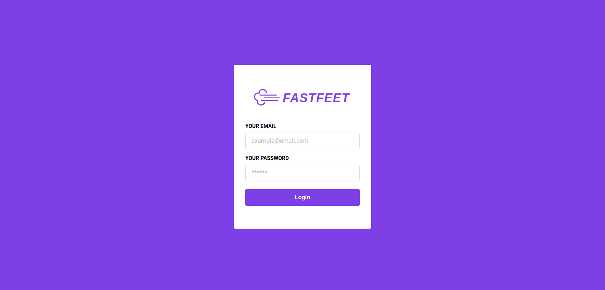
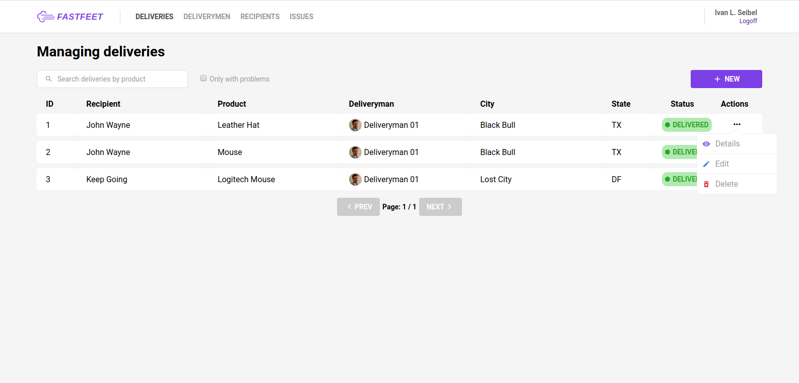
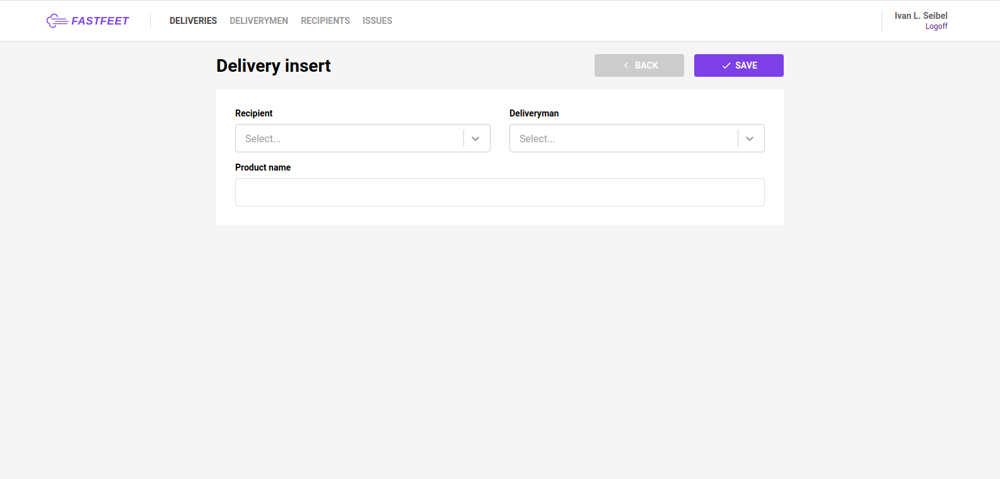

<h1 align="center">
    
</h1>

<h3 align="center">
  
  <p>Project: Fastfeet - Delivery Service (front-end)</p>
</h3>

<p align="center">
  

  <a href="https://github.com/ivanseibel">
    
  </a>

  

  <a href="https://github.com/ivanseibel/fastfeet/stargazers">
    
  </a>
</p>

# Index

- [1. Project General Description](#1-project-general-description)
- [2. User stories](#2-user-stories)
  - [2.1. Persona: Admin user](#21-persona-admin-user)
- [3. Screen Captures](#3-screen-captures)
- [4. Technologies/libraries](#4-technologieslibraries)
- [5. How to run](#5-how-to-run)
- [6. License](#6-license)


# 1. Project General Description

This part of the project is a web interface to manage deliveries, deliverymen and recipients.

# 2. User stories

## 2.1. Persona: Admin user

You can see this user stories [HERE](https://github.com/ivanseibel/fastfeet/tree/master/backend#21-persona-admin-user).

# 3. Screen Captures

## 3.1. Login

Page to administrator users login into the system.

<p>
  
</p>

## 3.2. Deliveries

In this page administrators can:

- See basic info and navigate by the deliveries list.
- Filter deliveries list by product name.
- Filter deliveries list with issues.
- See delivery details.
- Create a new delivery.
- Edit delivery data.
- Delete a delivery.

<p>
  
</p>

## 3.3. Delivery insert

Page where administrators can create new deliveries.

<p>
  
</p>

# 4. Technologies/libraries

- @rocketseat/unform: Easy peasy highly scalable ReactJS & React Native forms.
- @testing-library/jest-dom: Custom jest matchers to test the state of the DOM.
- @testing-library/react: Simple and complete React DOM testing utilities that encourage good testing practices.
- @testing-library/user-event: Fire events the same way the user does.
- axios: Promise based HTTP client for the browser and node.js.
- history: The history library lets you easily manage session history anywhere JavaScript runs.
- immer: Create your next immutable state by mutating the current one.
- intl: Polyfill the ECMA-402 Intl API (except collation).
- polished: A lightweight toolset for writing styles in Javascript.
- prop-types: Runtime type checking for React props and similar objects.
- react: React is a JavaScript library for building user interfaces.
- react-dom: React package for working with the DOM.
- react-helmet: A document head manager for React.
- react-icons: SVG React icons of popular icon packs using ES6 imports.
- react-redux: Official React bindings for Redux.
- react-router-dom: DOM bindings for React Router.
- react-scripts: Configuration and scripts for Create React App.
- react-select: A Select control built with and for ReactJS.
- react-toastify: React notification made easy.
- reactotron-react-js: A development tool to explore, inspect, and diagnose your React JS/DOM apps.
- reactotron-redux: A Reactotron plugin for Redux.
- reactotron-redux-saga: A Reactotron plugin for Redux Saga.
- redux: Predictable state container for JavaScript apps.
- redux-persist: Persist and rehydrate redux stores.
- redux-saga: Saga middleware for Redux to handle Side Effects.
- styled-components: Visual primitives for the component age. Use the best bits of ES6 and CSS to style your apps without stress.
- yup: Dead simple Object schema validation.
- babel-eslint: Custom parser for ESLint.
- eslint: An AST-based pattern checker for JavaScript.
- eslint-config-airbnb: Airbnb's ESLint config, following our styleguide.
- eslint-config-prettier: Turns off all rules that are unnecessary or might conflict with Prettier.
- eslint-plugin-import: Import with sanity.
- eslint-plugin-jsx-a11y: Static AST checker for accessibility rules on JSX elements.
- eslint-plugin-prettier: Runs prettier as an eslint rule.
- eslint-plugin-react: React specific linting rules for ESLint.
- eslint-plugin-react-hooks: ESLint rules for React Hooks.
- prettier: Prettier is an opinionated code formatter.

# 5. How to run

Clone this repository:

```bash
$ git clone https://github.com/ivanseibel/fastfeet
```

Get inside the new created folder "fastfeet/frontend"

```bash
$ cd fastfeet/frontend
```

Configure axios baseURL at ./src/services/api.js.

```javascript
import axios from 'axios';

const api = axios.create({
  baseURL: 'http://localhost:3333',
});

export default api;
```

Install all components:

```bash
$ yarn
```

Run the app:

```bash
$ yarn start
```

You can see the instructions to get up the API [HERE](https://github.com/ivanseibel/fastfeet/tree/master/backend#6-how-to-run).

**IMPORTANT**: axios baseURL must be equal to APP_URL const from back-end .env file, or front-end will not show avatars correctly.

# 6. License

This project is under MIT license.

### Status: under construction :construction: :construction_worker:
