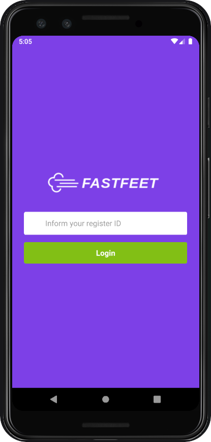

<h1 align="center">
    
</h1>

<h3 align="center">
  
  <p>Project: Fastfeet - Delivery Service (mobile)</p>
</h3>

<p align="center">
  

  <a href="https://github.com/ivanseibel">
    
  </a>

  

  <a href="https://github.com/ivanseibel/fastfeet/stargazers">
    
  </a>
</p>

# Index

- [1. Project General Description](#1-project-general-description)
- [2. User stories](#2-user-stories)
  - [2.1. Persona: Deliveryman user](#21-persona-deliveryman-user)
- [3. Screen Captures](#3-screen-captures)
- [4. Technologies/libraries](#4-technologieslibraries)
- [5. How to run](#5-how-to-run)
- [6. License](#6-license)


# 1. Project General Description

This React Native mobile app is one part of three that implement an application for a delivery service company. This project is one of several constructed during GoStack Bootcamp, a course offered by [Rocketseat](http://www.rocketseat.com.br) that dive deep into one of most popular stacks to software development for web and mobile.

# 2. User stories

## 2.1. Persona: Deliveryman user

You can see this user stories [HERE](https://github.com/ivanseibel/fastfeet/tree/master/backend#22-persona-deliveryman-user).

# 3. Screen Captures

## 3.1. Login

Page to deliverymen login into the system.

<p>
  
</p>

## 3.2. Deliveries

In this page deliverymen can:

- xxx
- xxx

<p>
  
</p>

### 3.2.1. Delivery xxx

Page where deliverymen can xxx.

<p>
  
</p>


# 4. Technologies/libraries

- @react-native-community/async-storage: Asynchronous, persistent, key-value storage - system for React Native.
- @react-native-community/masked-view: React Native MaskedView component for iOS.
- @react-navigation/bottom-tabs: Bottom tab navigator following iOS design guidelines.
- @react-navigation/native: React Native support for React Navigation.
- @react-navigation/stack: Provides a way for your app to transition between screens where each new screen is placed on top of a stack.
- axios: Promise based HTTP client for the browser and node.js.
- date-fns: Modern JavaScript date utility library.
- immer: Create your next immutable state by mutating the current one.
- prop-types: Runtime type checking for React props and similar objects.
- react: React is a JavaScript library for building user interfaces.
- react-native: Create native apps for Android and iOS using React.
- react-native-camera: A Camera component for React Native. Also reads barcodes.
- react-native-elements: React Native Elements & UI Toolkit.
- react-native-gesture-handler: Experimental implementation of a new declarative API for gesture handling in react-native.
- react-native-reanimated: Alternative and enhanced implementation of React Native's Animated API.
- react-native-safe-area-context: A more flexible `<SafeAreaView>`
- react-native-screens: First incomplete navigation solution for your react-native app.
- react-native-vector-icons: Customizable Icons for React Native with support for NavBar/TabBar/ToolbarAndroid, image source and full styling.
- react-redux: Official React bindings for Redux.
- reactotron-react-native: A development tool to explore, inspect, and diagnose your React Native apps.
- reactotron-redux: A Reactotron plugin for Redux.
- reactotron-redux-saga: A Reactotron plugin for Redux Saga.
- redux: Predictable state container for JavaScript apps.
- redux-persist: Persist and rehydrate redux stores.
- redux-saga: Saga middleware for Redux to handle Side Effects.
- styled-components: Visual primitives for the component age. Use the best bits of ES6 and CSS to style your apps without stress.
- @babel/core: Babel compiler core.
- @babel/runtime: Babel's modular runtime helpers.
- @react-native-community/eslint-config: ESLint config for React Native.
- babel-eslint: Custom parser for ESLint.
- babel-jest: Jest plugin to use babel for transformation.
- babel-plugin-root-import: Babel Plugin to enable relative root-import.
- eslint: An AST-based pattern checker for JavaScript.
- eslint-config-airbnb: Airbnb's ESLint config, following our styleguide.
- eslint-config-prettier: Turns off all rules that are unnecessary or might conflict with Prettier.
- eslint-import-resolver-babel-plugin-root-import: Fork of eslint-import-resolver-babel-root-import that works.
- eslint-plugin-import: Import with sanity.
- eslint-plugin-jsx-a11y: Static AST checker for accessibility rules on JSX elements.
- eslint-plugin-prettier: Runs prettier as an eslint rule.
- eslint-plugin-react: React specific linting rules for ESLint.
- eslint-plugin-react-hooks: ESLint rules for React Hooks.
- jest: Delightful JavaScript Testing.
- metro-react-native-babel-preset: Babel preset for React Native applications.
- prettier: Prettier is an opinionated code formatter.
- react-test-renderer: React package for snapshot testing.

# 5. How to run

Clone this repository:

```bash
$ git clone https://github.com/ivanseibel/fastfeet
```

Get inside the new created folder "fastfeet/mobile"

```bash
$ cd fastfeet/mobile
```

Configure axios baseURL at ./src/services/api.js. To avoid network issues, I recommend use real local network address in API and mobile app.

```javascript
import axios from 'axios';

const api = axios.create({
  baseURL: 'http://192.168.1.104:3333',
});

export default api;
```

Install all components:

```bash
$ yarn
```

Run the metro bundler:

```bash
$ yarn start
```

Upload app to emulator/device:

```bash
$ yarn android
```

**ABOUT iOS**

This app is probably 100% iOS compatible, but it cannot be tested. I recommend run the app using Android emulator or physical devices.

**IMPORTANT**

Axios baseURL must be equal to APP_URL const from back-end .env file, or front-end will not show avatars correctly.

You can see the instructions to get up the API [HERE](https://github.com/ivanseibel/fastfeet/tree/master/backend#6-how-to-run).

# 6. License

This project is under MIT license.
